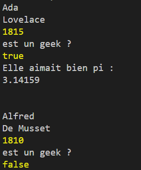

###### Intro à la programmation
# Les variables

## Avant-propos

### Les point-virgules

Dans les exemples ci-après, vous verrez que toutes les lignes de code se terminent par un `;` (point-virgule).

C'est une règle dans un grand nombre de langages de programmation que de finir les instructions de code par des point-virgules. 

En vérité JavaScript peut s'en passer car il est doté de l'*ASI* (*Automatic Semicolon Insertion*) qui va ajouter automatiquement des point-virgules aux bons endroits. Seulement, pour cela, encore faut-il que votre code soit correctement structuré en respectant les règles de l'ASI.

C'est pourquoi, pour faire simple, nous partirons du principe que, sauf instruction contraire explicite, nous mettrons toujours des point-virgules à la fin des lignes de code en JavaScript.

En PHP, en C, en C++, en Java, le problème ne se poserait pas, l'usage des point-virgules est juste purement et simplement obligatoire, sinon, le programme refuse de s'exécuter.

### Les commentaires

Vous verrez aussi, dans des exemples de code des doubles slash `//` ou des slashs `/` suivis ou précédés d'astérisques `*`.

**Exemple :**

```javascript
code; // Ce commentaire est sur une seule ligne
code; // je dois remettre des // à  chaque nouvelle ligne

/*
    Ou alors j'écris mon commentaire comme ceci
    C'est beaucoup plus pratique pour faire 
    des commentaires de plusieurs lignes.
*/

/************************************************
 * Gros bloc
 * 
 * Et alors, là, c'est le top du top.
 * Cela permet de facilement identifier
 * et commenter un gros bloc de code
 * qui va suivre
 ************************************************/
code;
```

Ce sont là des commendaires, dans le code. Ils n'ont pas le moindre effet sur l'exécution du programme mais sont très utilisés pour laisser des remarques aux autres personnes, ou même à soi-même, pour plus tard.

⚠️⚠️⚠️ Un code bien commmenté est une obligation en programmation. Et, cela peut même être un critère objectif de rejet d'une candidature si le recruteur n'en trouve pas dans le code lors d'un test d'embauche.⚠️⚠️⚠️

## Concept de variable

La notion de *variable* est le premier concept fondamental de la programmation que vous allez devoir maîtriser. 

En programmation, une variable est l'association d'un nom (l'identifiant) à une valeur. On peut voir cela comme un tiroir. Tiroir auquel le développeur va donner le nom qu'il souhaite et dans lequel il va pouvoir ranger la valeur de son choix. 

Par exemple dans l'expression suivante :

```javascript
annee = 1815;
```

Le mot `annee` est une variable. Et `1815` la valeur que l'on y stocke.

Une variable peut évoluer dans le temps, on pourra changer sa valeur selon notre bon vouloir. Le code suivant est donc parfaitement valide :

```javascript
annee = 1815;
annee = 1816;
annee = 1817;        
```

## Création et initialisation de variables

### Les instructions `let` et `var`

Dans la plupart des langages de programmation, avant d'utiliser une variable, il faut la *déclarer*. Ou, dit autrement, il faut informer le programme qu'on crée la variable, et ensuite seulement, on peut l'utiliser. 

Pour faire cela en JavaScript, on utilise les instructions `let` ou `var` placées devant le nom de la variable. 

**Exemple :**

```javascript
var annee;
let prenom;
let nom;

annee = 1815;
prenom = 'Ada';
nom = 'Lovelace';
```

Notez comme la partie *déclaration* de la variable vient avant son utilisation. 

L'instruction `var` est ancienne, elle existe depuis les fondements de javascript (1995). L'instruction `let` quant à elle est beaucoup plus récente (2015). 

Il existe une guerre interne chez les développeurs JavaScript depuis l'apparition de `let` sur l'usage, ou non, de `var`. 

De nombreux développeurs vous diront seulement *"Bah ! Maintenant faut mettre des `let` partout et arrêter d'utiliser des `var` !"*

  

Le seul arguments des *"pro-let"* étant, en substance :  *"Bah ! C'est quand même vachement beaucoup plus mieux"*, voici pour vous l'explication complète des avantages et inconvénients réels de l'un et de l'autre. 

var | let 
---|---
**porté globale** | **portée dans le bloc** uniquement
peut-être **déclarée globalement** et on peut y **accéder globalement** | peut-être **déclarée globalement** mais **on ne peut pas y accéder globalement**
**on peut redéclarer** une variable créée avec var | **on ne peut pas redéclarer** une variable créée avec let
**une var est hissée** : on peut la déclarer après l'avoir utilisé | **une let n'est pas hissée** : on doit d'abord la déclarer, et l'utiliser ensuite

Vous n'avez pas encore *- mais ça viendra -* la possibilité de comprendre ce tableau. Mais, gardez le sous le coude pour plus tard. Ça vous évitera de passer pour une truffe lors d'un entretien d'embauche, et puis ça vous permettra de vous la péter dans les diners geeks.

À ce niveau de votre apprentissage, retenez ceci :

- on déclare les variables avant de les utiliser
- on va toujours utiliser uniquement `let`, pour le moment.
- on mettra peut-être `var` plus tard si une situation le justifie

### L'instruction `const`

Il est également possible de créer des *constantes* qui, contrairement aux variables déclarées avec `let` ou `var`, ne peuvent pas être modifiées ultérieurement.

 On utilise les constantes lorsque l'on veut stocker une valeur pour s'en servir plus tard, un peu partout dans son programme, tout en sachant par avance que cette valeur n'aura jamais à changer.

On déclare une constante en utilisant l'instruction `const`, comme suit :

```javascript
const pi = 3.14159;
```

Écrire le code suivant, est incorrect et générera une erreur :

```javascript
const pi = 3.14159;
pi = 3;
```

  

### Déclarations et initialisations multiples

Il est posible de déclarer une variable et de l'initialiser *- lui assigner une valeur -* en une seule commande, comme suit :

```javascript
let annee = 1815;
```

Il est également possible de déclarer plusieur variables en une seule fois en les séparant par des virgules (,) :

```javascript
let annee, prenom, nom;
```

Et, cerise sur le pompon, on peut aussi initialiser ces mêmes variables comme suit :

```javascript
let annee = 1815, prenom = 'Ada', nom = 'Lovelace';
```

☣️ Attention toutefois à utiliser cette dernière possibilité avec parcimonie sans quoi vous risquez de produire un code difficilement lisible.

Préférez alors la présentation suivante, beaucoup plus lisible :

```javascript
let annee = 1815,
    prenom = 'Ada',
    nom = 'Lovelace';
```
Ou, encore mieux, celle-ci (avec des tabulations):
```javascript
let annee   = 1815,
    prenom  = 'Ada',
    nom     = 'Lovelace';
```
Ça, c'est du beau code comme les recruteurs aiment en voir.

## Les *types* de variables

### Avant-propos : des langages dits *"typés"*

Javascript n'est pas à proprement parler ce que l'on appelle, en jargon *geek*, un *langage typé*. 

Un *langage typé* est un langage dans lequel une variable est, dès sa création, déclarée comme étant d'un certain *type* bien précis que l'on ne pourra plus changer ensuite et qui ne pourra accepter qu'un certain *type* de valeurs. 

Dans un *langage typé* on ne pourra pas, par exemple, stocker le mot *"cinq"* dans une variable de type *entier*. Ça n'est pas fait pour ça, ça ne rentre pas. La valeur *5.00*, nombre décimal, ne rentrerait pas non plus d'ailleurs, mais la valeur *5*, oui.
 
En JavaScript, on est un petit peu moins embêté[^1], puisque les variables peuvent accepter n'importe quel type de valeur à tout moment. Les valeurs en revanche, elles, sont bien d'un type précis.

Il y a les textes, les nombres entiers, les nombres à virgule...

Nous allons passer en revue les types principaux.

[^1]: Il est dors et déjà prévu de rendre JavaScript plus *typé* qu'il n'est, des évolutions sont en cours pour aller dans ce sens dans les prochaines versions de JavaScript

### Le type *string*

La *string* est une chaîne de caractères. On l'utilise dès que l'on veut mettre du texte dans son programme.

**Exemple :**

```javascript
let prenom  = 'Ada';
let nom     = 'Lovelace';
```

Dans cet exemple `'Ada'` et `'Lovelace'` sont des textes, leur type est *string*.

En javascrit, on écrit toujours les *strings* entre simples quotes (`'`), doubles quotes (`"`) ou backtilt (`` ` ``). La notation avec simples quotes (`'`) est recommandée par souci de facilité de travail avec le HTML : 

```javascript
let monHTML = ''
```

Quoiqu'il en soit, il est vivement conseillé d'opter pour une seule notation et de ne pas en changer en cours de route.

Si vous avez besoin d'afficher, dans une *string*, des quotes (`'`) ou (`"`), vous aurez peut-être besoin *d'échapper* ceux-ci, c'est à dire de les faire précéder du signe (`\`), qui indique à la machine que le caractère qui suit doit être pris comme du simple texte, pas comme la fin de la *string*.

**Exemple :**

```javascript
let nonCorrect  = 'Ceci n'est pas correct';
let nomCorrect2 = ""Cela non plus", dit-il";
let Correct     = 'Ceci l\'est en revanche';
let Correct2    = "\"Et cela aussi\", ajouta-t-il";
```

Ceci-dit, comme dans l'exemple de HTML vu plus haut, vous pouvez librement utiliser des `'` à l'intérieur de *strings* délimitées par `"` et inversement :

```javascript
let Correct     = 'Mettre des " " ainsi est correct';
let Correct2    = "Mettre des ' ' comme ceci aussi";
```

☣️ Mais, redisons-le, il est préférable d'opter pour un style d'écriture et ne pas en changer en cours de route. Un autre développeur - et un recruteur encore plus - préfèrera vous voir *échapper* vos `'` ou vos `"`, les rares fois ou c'est nécessaire, plutôt que de voir vos *strings* passer de l'un à l'autre selon votre humeur ou la météo qu'il fait dehors.

### Le type *number*

Le type *number* regroupe à la fois les nombres entiers (1, 2, 3, 4, 6) et les nombres dits à virgule flottante (3.14159). On l'utilise beaucoup pour compter et faire des opérations mathématiques.

Il est préferable de distinguer les entiers, dits *integer*, des nombres à virgules flottante, dits *float*. D'abord parce que la plupart des langages de programmation font cette distinction, et que c'est donc une bonne habitude à prendre. Et, ensuite, parce que même en JavaScript, il existe de nombreuses situations dans lesquelles cette distinction sera vitale si on ne veut pas planter son programme.

A compter de maintenant, nous ferons donc toujours la distinction en parlant de *integers* et de *floats*, et non plus simplement de *numbers*.

**Exemple :**

```javascript
let a = 10;     // Ceci est un integer
let b = 4.55;   // Ceci est un float
```

Notez comme pour préciser un *float* on utilise le *point* `.` et non la *virgule* `,`. Système américain oblige.

### Le type *boolean*

Un *booléen*, ou *boolean* en anglais, et simplement une variable ne pouvant prendre que deux valeurs : *true* ou *false* (*vrai* ou *faux*).

Cela équivaut à dire que la variable contient `oui` ou `non`. Cela devient très pratique lorsque l'on veut faire des tests pour savoir si quelque chose est vrai ou pas dans notre code.

**Exemple :**

```javascript
let annee   = 1815,
    prenom  = 'Ada',
    nom     = 'Lovelace';
    geek    = true; // geek étant true, on en déduit qu'Ada Lovelace était une Geek

let annee2   = 1810,
    prenom2  = 'Alfred',
    nom2     = 'De Musset';
    geek2    = false; // Ce qui n'était visiblement pas le cas d'Alfred De Musset   
```
 

### Le type *bigInt*

En javascript le type *number* est limité à un intervalle  de -2^53^ - 1 à +2^53^ - 1 c'est à dire de -9007199254740991 à  +9007199254740991.

Bref. C'est beaucoup. Et c'est bien suffisant pour 99,99% des usages qui pourraient vous venir à l'esprit.

Ceci dit, dans l'hypothèse ou vous devriez, un jour, développer un programme impliquant des Mathématiques lourdes, sachez qu'il existe également le type *BigInt* qui, lui, n'a pas de limite.

On écrit un *BigInt* en ajoutant à la fin de la valeur la lettre `n` comme ceci :

```javascript
const entierNormal  = 1234567890;
const grosEntier    = 1234567890123456789012345678901234567890n;
```

Bon, très honnêtement, les *BigInts*, c'est vraiment pour les grosses têtes, les chercheurs, et les savants fous qui envoient des DeLorean dans le turfu. 

Les chances que vous en ayez besoin un jour doivent-être d'environ une sur 9007199254740992.

 

### Les valeurs *null* et *undefined*

Il existe en JavaScript deux valeurs très spéciales que sont *null* et *undefined*. Toutes deux sont très proches, et veulent dire, peu ou prou, la même chose : "*rien*", mais avec des nuances importantes tout de même.

#### *undefined*

Pour comprendre, mieux vaut commencer par *undefined*.

Observons le code suivant :

```javascript
01 let nom;
02 
03 nom = 'Lovelace';
```

À la ligne `01` la variable *nom* est créée. 
À la ligne `03` on stocke la *string* *'Lovelace'* à l'intérieur.
Entre les deux, à la ligne `02`, *nom* n'étant pas défini, sa valeur est *undefined* (*non-défini*). 

C'est le programme qui met automatique cette valeur dans la variable, enfin, si tant est qu'on puisse parler de valeur. Ceci, dans l'attente d'une future assignation d'une valeur réelle.

Vous apprendrez prochainement qu'il est possible de tester si une variable a été correctement définie, ou si elle est *undefined*.

#### *null*

La valeur *null*, contrairement à *undefined*, n'est pas assignée automatiquement par le programme, c'est le travail du développeur. Et, en général, c'est le signe d'un développeur qui fait bien son travail.

*null* signifierait *"vide"*, *"rien"*, *"valeur inconnue"*, ou même, parce que c'est plutôt ainsi qu'on l'utilise la plupart du temps : *"valeur pas encore connue"*... Sous entendu : *"mais t'inquiète, ça va venir"*.

C'est le minimum que devrait normalement fournir tout développeur lorsqu'il crée ses variables et qu'il ne sait pas encore ce qu'il va y mettre.

On aurait fort bien pu écrire le code précédent ainsi :

```javascript
01 let nom = null;
02 
03 nom = 'Lovelace';
```

Cela n'a l'air de rien là comme ça, mais vous découvrirez rapidement que *null* est une valeur universelle et qu'il est très important de pouvoir tester si une variable est *null*, ou pas, avant d'essayer de s'en servir.

L'usage de *null* deviendra encore plus important lorsque vous passerez au *PHP*, au base de données avec *SQL* et à la *Programmation Orientée Objet*.

## Pratique

Lancer le programme `01-les-variables.js` avec la commande `node 01-les-variables.js`.

Ce programme affiche juste des messages dans le terminal les unss après les autres en utilisant des variables et constantes :

 

Oui ! C'est moche. Mais, avant de faire du beau, va falloir mettre les mains dans le camboui.

N'hésitez pas à ouvrir le fichier `01-les-variables.js` et à le modifier à volonté pour tester par vous même.

## En Résumé

- on crée des variables avec `let`, on peut modifier une variable 
- on crée des constantes avec `const`, on ne peut pas modifier une constante 
- on *stocke* une valeur dans une variable ou constante avec le signe `=`
- Les quatre grands types de valeurs possibles sont :
    - *string* : du text entre `""` ou `''`
    - *integer* : les nombres entiers
    - *float* : les nombres à virgule
    - *boolean* : les booléens, `true` ou `false`
- Il est *propre* de mettre `null` comme valeur par défaut si on ne sait pas encore quoi mettre 
